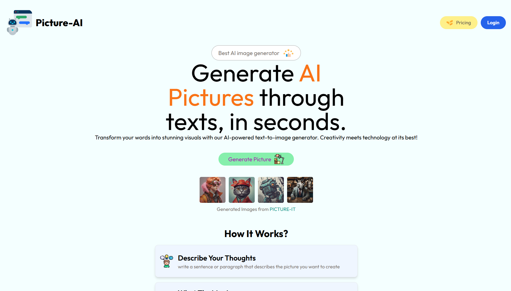
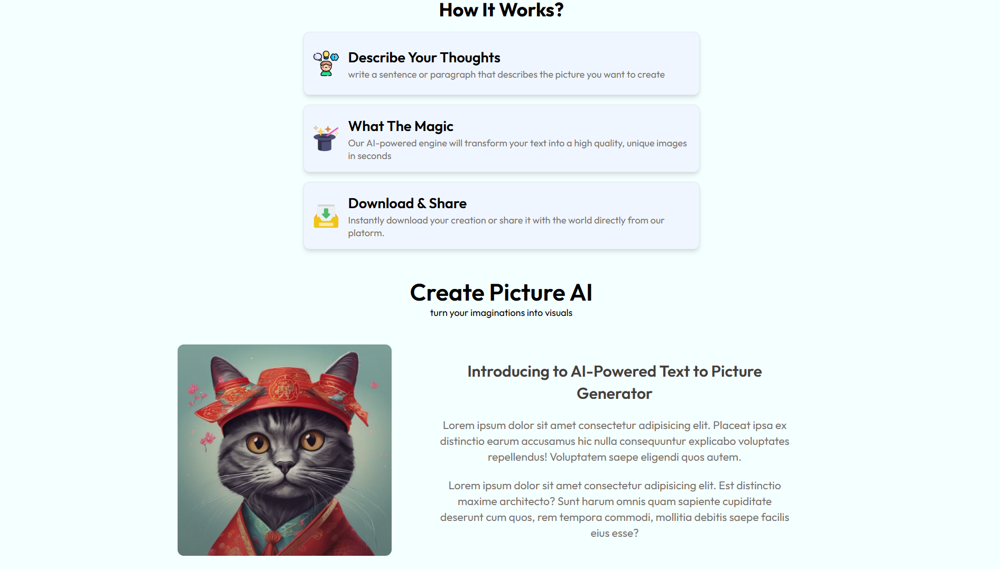
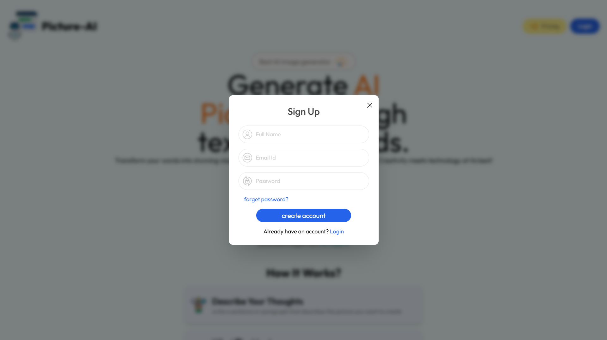
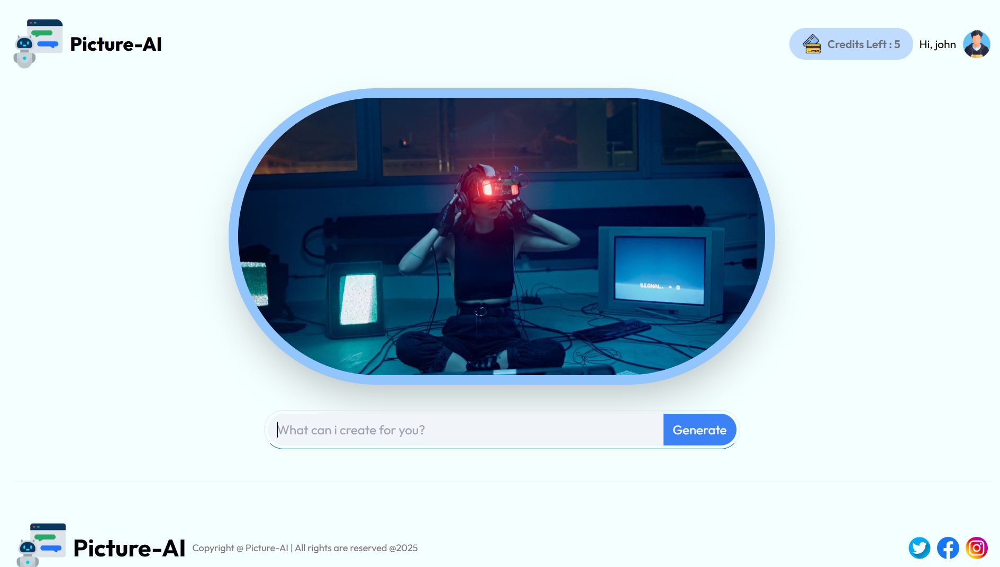
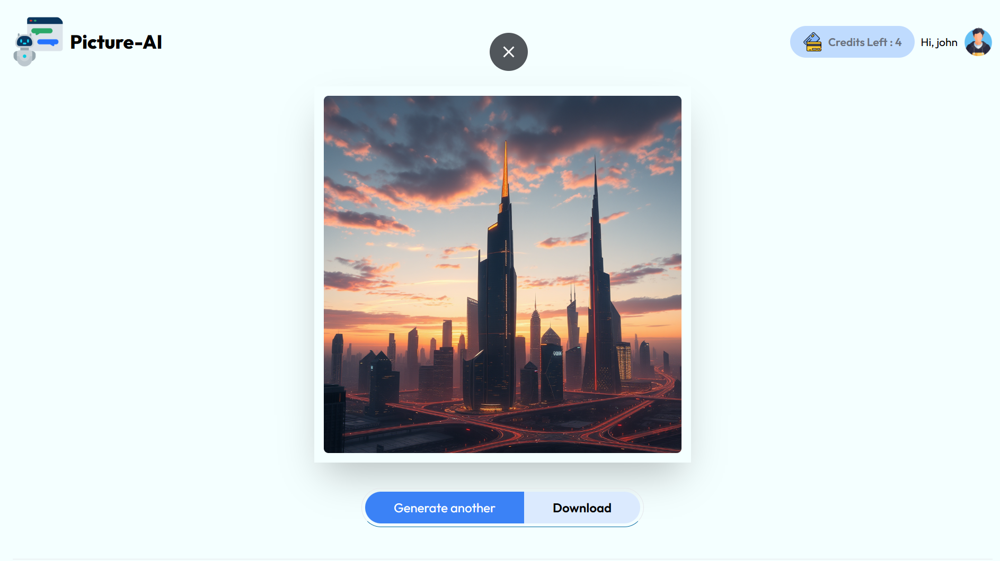

# 🖼️ AI Text to Image Generator

An AI-powered text-to-image generation app built with React, Express, and MongoDB, using the ClipDrop API to convert text prompts into realistic images.

---

## 🚀 Features

- 🔐 **User Authentication** (Signup & Login)
- 🎨 **AI Image Generation** using [ClipDrop API](https://clipdrop.co/)
- 💰 **Credit System**
  - Each new user gets **5 free credits**
  - 1 image = 1 credit
  - Option to "Buy More Credits" (dummy flow for now)
- 💾 **Download Generated Images**
- ⚙️ **Tech Stack**
  - Frontend: **React**
  - Backend: **Node.js + Express**
  - Database: **MongoDB**
  - Third-Party API: **ClipDrop (text-to-image)**

---

## 🧪 How It Works

1. User signs up / logs in
2. Gets **5 free credits**
3. Enters a prompt like: `"A futuristic cityscape at sunset"`
4. AI generates image using ClipDrop
5. User can **download** the image
6. Once credits are used, "Buy More Credits" button appears (dummy for now)

---


## 📷 Screenshots

### 🏠 Home Page


### 🏠 Home Page


### 🔐 Signup Page


### ✍️ Prompt Entry Page


### 🖼️ Result / Output Page



---

## 🛠️ Installation (Dev Setup)

```bash
# Clone the repository
git clone https://github.com/your-username/your-repo-name.git
cd your-repo-name

# Install frontend & backend dependencies
cd client
npm install
cd ../server
npm install
